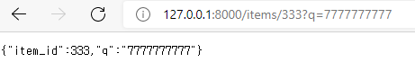
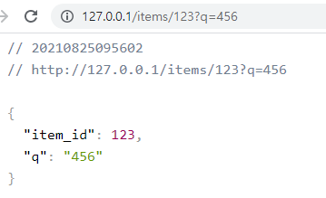
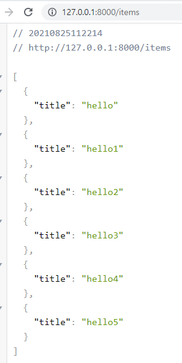

# 프로젝트 개요

- FAST API 및 Docker 실습

## 프로젝트 구성

### 테스트 - [commit#1](6de4ec95a080cb38c93c7fbc04b769e7a66ab4e0)

- [공식문서](https://fastapi.tiangolo.com/deployment/docker/#raspberry-pi-and-other-architectures) 를 따라 실습을 진행합니다.

- 처음에 가상환경을 만들어서 테스트 해보았습니다.
    - `pipenv shell`
    - `pipenv --venv` 로 경로를 확인해서 가상환경을 vscode에 반영해주었습니다.

- 테스트결과

### With Docker - [commit#2](23909356148f189ef64ce9e2bb227aabd9c3a635)

- 도커환경에서 필요한 라이브러리를 설치할수있게 pip freeze로 requirements.txt를 생성해주었습니다.
- `docker build -t fastapi .` 명령어로 도커 이미지를 생성합니다.
- `docker run -d --name fastapiContainer -p 80:80 fastapi` 명령어로 fastapi 이미지를 fastapiContainer라는 컨테이너 이름으로 실행합니다.

- 테스트결과

### FastAPI & Postgresql without Docker

- local 환경에서 postgresql과 fastapi를 함께 사용하였습니다.
- [공식문서](https://fastapi.tiangolo.com/tutorial/sql-databases/) 를 따라 진행하였습니다.
    - 최소한의 구현만 하기위해 삭제된 부분이 있습니다.
    - user부분은 구현하지 않고 item부분만 진행하였습니다.
- POST request는 vscode Thunder client extension으로 진행하였습니다.

- 테스트결과

